# terraform-aws-security-group-module-template
- [Overview](#overview)
- [Project Structure](#project-structure)
- [Usage](#usage)
- [Prerequisites](#prerequisites)
- [TO DO](#to-do)
- [Scripts](#scripts)
- [Test Cases](tests/README.MD#test-cases)
- [Contributing](#contributing)
- [Disclaimer](#disclaimer)
- [License](#license)
- [Mermaid](#mermaid)

# Overview
- Generate AWS security-group configuration in a single module using json files converted from traditional csv dataflow templates
- Python manages state of json files used for Terraform to build rules

# Project Structure
```
terraform-aws-sg-module-template/
├── main.tf
├── providers.tf
├── variables.tf
├── sg_rules/
│   ├── aws_security_group.sgs[each.value.name].json
├── firewall_rules.csv
├── rule_conversion.py
└── README.md
```

# Usage
- Define firewall rules in [firewall_rules.csv](https://github.com/drewpypro/terraform-aws-sg-module-template/blob/main/firewall_rules.csv)
- Run [rule_conversion.py](https://github.com/drewpypro/terraform-aws-sg-module-template/blob/main/rule_conversion.py)
- Terraform apply

## Prerequisites
```
AWS_ACCESS_KEY_ID
AWS_SECRET_ACCESS_KEY
BUCKET_ACCESS_KEY_ID
BUCKET_ENDPOINT
BUCKET_KEY
BUCKET_NAME
BUCKET_SECRET_ACCESS_KEY
```

# TO DO

- Make conversion script remove files (if SG is deleted)
- Incorporate into [aws-eks-drewpy](https://github.com/drewpypro/aws-eks-drewpy)
- Make mermaid better
- Custom Rules (If this is being used as a shared template module)

# Scripts

## Security Group Rules Validator and Generator [rule_conversion.py](https://github.com/drewpypro/terraform-aws-sg-module-template/rule_conversion.py)
- This script automates the validation and generation of json rules used for AWS Security Group modules. 
  1. Reads firewall_rules.csv
  2. Performs Validation
    - All fields must be present and valid. 
    - IPv4/IPv6 validation
    - Multiple input detection (referenced_security_group_id, cidr_ipv4, cidr_ipv6)
    - Duplicate rule detection
  3. Converts rules into JSON format used in [terraform-aws-sg-module-template](https://github.com/drewpypro/terraform-aws-sg-module-template)
  4. Maintains state and empties rules for removed security groups. 

# Contributing

- Fork the repository.
- Create a new branch for your feature or bugfix.
- Make your changes and test them thoroughly.
- Submit a pull request for review.

# Disclaimer

This project is provided "as is" without warranty of any kind, express or implied, including but not limited to the warranties of merchantability, fitness for a particular purpose, and noninfringement. Use this project at your own risk. The maintainers of this repository are not responsible for any damage or issues arising from its use.

# License

This project is licensed under the MIT License. This means you are free to use, modify, and distribute the code as long as credit is given to the original author.

```
Copyright (c) 2025 drewpypro

Permission is hereby granted, free of charge, to any person obtaining a copy
of this software and associated documentation files (the "Software"), to deal
in the Software without restriction, including without limitation the rights
to use, copy, modify, merge, publish, distribute, sublicense, and/or sell
copies of the Software, and to permit persons to whom the Software is
furnished to do so, subject to the following conditions:

The above copyright notice and this permission notice shall be included in all
copies or substantial portions of the Software.
```

# Mermaid 

```mermaid
flowchart LR
    %% Styles
    classDef default fill:#1a2433,stroke:#fff,stroke-width:2px,color:#fff
    classDef lb fill:#d86613,stroke:#fff,stroke-width:2px,color:#fff
    classDef nodes fill:#007acc,stroke:#fff,stroke-width:2px,color:#fff
    classDef data fill:#3b48cc,stroke:#fff,stroke-width:2px,color:#fff
    classDef infra fill:#c94f17,stroke:#fff,stroke-width:2px,color:#fff
    classDef external fill:#454545,stroke:#fff,stroke-width:2px,color:#fff

    %% General Subnet Subnet
    subgraph general_subnet [General Subnet]
        rds[Rds]
        msk[Msk]
        opensearch[Opensearch]
        elasti_cache[Elasti Cache]
        efs_mount_endpoint[Efs Mount Endpoint]
        dms[Dms]
    end

    %% Paas Subnet Subnet
    subgraph paas_subnet [Paas Subnet]
        istio_nodes[Istio Nodes]
        internet_istio_nodes[Internet Istio Nodes]
        worker_nodes[Worker Nodes]
        cluster_endpoint[Cluster Endpoint]
    end

    %% Lambda Subnet Subnet
    subgraph lambda_subnet [Lambda Subnet]
        app1_lambda[App1 Lambda]
        app2_lambda[App2 Lambda]
    end

    %% Nlb Subnet Subnet
    subgraph nlb_subnet [Nlb Subnet]
        nlb[Nlb]
    end

    %% Internet Nlb Subnet Subnet
    subgraph internet_nlb_subnet [Internet Nlb Subnet]
        internet_nlb[Internet Nlb]
    end

    %% Vpce Subnet Subnet
    subgraph vpce_subnet [Vpce Subnet]
        vpce_autoscaling[Vpce Autoscaling]
        vpce_dms[Vpce Dms]
        vpce_ec2[Vpce Ec2]
        vpce_ec2messages[Vpce Ec2Messages]
        vpce_efs[Vpce Efs]
        vpce_eks[Vpce Eks]
        vpce_elasticache[Vpce Elasticache]
        vpce_elasticloadbalancing[Vpce Elasticloadbalancing]
        vpce_kms[Vpce Kms]
        vpce_lambda[Vpce Lambda]
        vpce_logs[Vpce Logs]
        vpce_monitoring[Vpce Monitoring]
        vpce_rds[Vpce Rds]
        vpce_s3[Vpce S3]
        vpce_sns[Vpce Sns]
        vpce_sqs[Vpce Sqs]
        vpce_sts[Vpce Sts]
        vpce_ssm[Vpce Ssm]
        vpce_ssmmessages[Vpce Ssmmessages]
        vpce_sts[Vpce Sts]
    end

    %% External Networks
    subgraph external_networks [External Networks]
        cidr_0.0.0.0_0[0.0.0.0/0]
        cidr_0.0.0.0_5[0.0.0.0/5]
        cidr_10.0.101.0_24[10.0.101.0/24]
        cidr_10.0.102.0_24[10.0.102.0/24]
        cidr_103.21.244.0_22[103.21.244.0/22]
        cidr_103.22.200.0_22[103.22.200.0/22]
        cidr_103.31.4.0_22[103.31.4.0/22]
        cidr_104.16.0.0_13[104.16.0.0/13]
        cidr_104.24.0.0_14[104.24.0.0/14]
        cidr_108.162.192.0_18[108.162.192.0/18]
        cidr_108.162.193.105_32[108.162.193.105/32]
        cidr_108.162.194.254_32[108.162.194.254/32]
        cidr_11.0.0.0_8[11.0.0.0/8]
        cidr_12.0.0.0_6[12.0.0.0/6]
        cidr_128.0.0.0_1[128.0.0.0/1]
        cidr_131.0.72.0_22[131.0.72.0/22]
        cidr_141.101.64.0_18[141.101.64.0/18]
        cidr_16.0.0.0_4[16.0.0.0/4]
        cidr_162.158.0.0_15[162.158.0.0/15]
        cidr_162.159.38.254_32[162.159.38.254/32]
        cidr_172.64.0.0_13[172.64.0.0/13]
        cidr_172.64.33.105_32[172.64.33.105/32]
        cidr_172.64.34.254_32[172.64.34.254/32]
        cidr_173.245.48.0_20[173.245.48.0/20]
        cidr_173.245.59.105_32[173.245.59.105/32]
        cidr_188.114.96.0_20[188.114.96.0/20]
        cidr_190.93.240.0_20[190.93.240.0/20]
        cidr_197.234.240.0_22[197.234.240.0/22]
        cidr_198.41.128.0_17[198.41.128.0/17]
        cidr_3.86.4.106_32[3.86.4.106/32]
        cidr_3.87.127.143_32[3.87.127.143/32]
        cidr_3.94.91.31_32[3.94.91.31/32]
        cidr_32.0.0.0_3[32.0.0.0/3]
        cidr_44.201.148.133_32[44.201.148.133/32]
        cidr_52.207.222.50_32[52.207.222.50/32]
        cidr_54.161.254.100_32[54.161.254.100/32]
        cidr_54.197.201.248_32[54.197.201.248/32]
        cidr_54.210.225.137_32[54.210.225.137/32]
        cidr_54.81.127.33_32[54.81.127.33/32]
        cidr_54.90.191.9_32[54.90.191.9/32]
        cidr_64.0.0.0_2[64.0.0.0/2]
        cidr_8.0.0.0_6[8.0.0.0/6]
        cidr_9.0.0.0_8[9.0.0.0/8]
    end

    %% Connections
    istio_nodes --> |30000-32767| cidr_10.0.101.0_24
    istio_nodes --> |30000-32767| cidr_10.0.102.0_24
    worker_nodes --> |443| internet_nlb
    istio_nodes --> |443| internet_nlb
    worker_nodes --> |30000-32767| internet_nlb
    istio_nodes --> |30000-32767| internet_nlb
    ec2_test_sg --> |80-40000| ec2_test_sg
    internet_nlb --> |80-40000| ec2_test_sg
    internet_nlb --> |30000-32767| istio_nodes
    internet_nlb --> |30000-32767| worker_nodes
    internet_nlb --> |80| cidr_103.21.244.0_22
    internet_nlb --> |443| cidr_103.21.244.0_22
    internet_nlb --> |80| cidr_103.22.200.0_22
    internet_nlb --> |443| cidr_103.22.200.0_22
    internet_nlb --> |80| cidr_103.31.4.0_22
    internet_nlb --> |443| cidr_103.31.4.0_22
    internet_nlb --> |80| cidr_104.16.0.0_13
    internet_nlb --> |443| cidr_104.16.0.0_13
    internet_nlb --> |80| cidr_104.24.0.0_14
    internet_nlb --> |443| cidr_104.24.0.0_14
    internet_nlb --> |80| cidr_108.162.192.0_18
    internet_nlb --> |443| cidr_108.162.192.0_18
    internet_nlb --> |80| cidr_131.0.72.0_22
    internet_nlb --> |443| cidr_131.0.72.0_22
    internet_nlb --> |80| cidr_141.101.64.0_18
    internet_nlb --> |443| cidr_141.101.64.0_18
    internet_nlb --> |80| cidr_162.158.0.0_15
    internet_nlb --> |443| cidr_162.158.0.0_15
    internet_nlb --> |80| cidr_172.64.0.0_13
    internet_nlb --> |443| cidr_172.64.0.0_13
    internet_nlb --> |80| cidr_173.245.48.0_20
    internet_nlb --> |443| cidr_173.245.48.0_20
    internet_nlb --> |80| cidr_188.114.96.0_20
    internet_nlb --> |443| cidr_188.114.96.0_20
    internet_nlb --> |80| cidr_190.93.240.0_20
    internet_nlb --> |443| cidr_190.93.240.0_20
    internet_nlb --> |80| cidr_197.234.240.0_22
    internet_nlb --> |443| cidr_197.234.240.0_22
    internet_nlb --> |80| cidr_198.41.128.0_17
    internet_nlb --> |443| cidr_198.41.128.0_17
    ec2_test_sg --> |0| istio_nodes
    ec2_test_sg --> |0| worker_nodes
    worker_nodes --> |0| ec2_test_sg
    istio_nodes --> |0| ec2_test_sg
    ec2_test_sg --> |8-0| istio_nodes
    ec2_test_sg --> |8-0| worker_nodes
    worker_nodes --> |8-0| ec2_test_sg
    istio_nodes --> |8-0| ec2_test_sg
    worker_nodes --> |123| cidr_3.86.4.106_32
    istio_nodes --> |123| cidr_3.86.4.106_32
    worker_nodes --> |123| cidr_3.87.127.143_32
    istio_nodes --> |123| cidr_3.87.127.143_32
    worker_nodes --> |123| cidr_3.94.91.31_32
    istio_nodes --> |123| cidr_3.94.91.31_32
    worker_nodes --> |123| cidr_44.201.148.133_32
    istio_nodes --> |123| cidr_44.201.148.133_32
    worker_nodes --> |123| cidr_52.207.222.50_32
    istio_nodes --> |123| cidr_52.207.222.50_32
    worker_nodes --> |123| cidr_54.161.254.100_32
    istio_nodes --> |123| cidr_54.161.254.100_32
    worker_nodes --> |123| cidr_54.197.201.248_32
    istio_nodes --> |123| cidr_54.197.201.248_32
    worker_nodes --> |123| cidr_54.210.225.137_32
    istio_nodes --> |123| cidr_54.210.225.137_32
    worker_nodes --> |123| cidr_54.81.127.33_32
    istio_nodes --> |123| cidr_54.81.127.33_32
    worker_nodes --> |123| cidr_54.90.191.9_32
    istio_nodes --> |123| cidr_54.90.191.9_32
    ec2_test_sg --> |1-65535| cidr_0.0.0.0_0
    ec2_test_sg --> |1-65535| worker_nodes
    ec2_test_sg --> |1-65535| istio_nodes
    worker_nodes --> |1-65535| ec2_test_sg
    istio_nodes --> |1-65535| ec2_test_sg
    worker_nodes --> |15017| worker_nodes
    worker_nodes --> |15017| istio_nodes
    istio_nodes --> |15017| worker_nodes
    istio_nodes --> |15017| istio_nodes
    cluster_endpoint --> |80-40000| ec2_test_sg
    ec2_test_sg --> |80-40000| cluster_endpoint
    worker_nodes --> |443| worker_nodes
    worker_nodes --> |443| istio_nodes
    istio_nodes --> |443| worker_nodes
    istio_nodes --> |443| istio_nodes
    worker_nodes --> |15012| worker_nodes
    worker_nodes --> |15012| istio_nodes
    istio_nodes --> |15012| worker_nodes
    istio_nodes --> |15012| istio_nodes
    worker_nodes --> |30000-32767| worker_nodes
    worker_nodes --> |30000-32767| istio_nodes
    istio_nodes --> |30000-32767| worker_nodes
    istio_nodes --> |30000-32767| istio_nodes
    cluster_endpoint --> |10250| istio_nodes
    cluster_endpoint --> |10250| worker_nodes
    worker_nodes --> |10250| cluster_endpoint
    istio_nodes --> |10250| cluster_endpoint
    worker_nodes --> |10250| worker_nodes
    worker_nodes --> |10250| istio_nodes
    istio_nodes --> |10250| worker_nodes
    istio_nodes --> |10250| istio_nodes
    cluster_endpoint --> |15017| worker_nodes
    cluster_endpoint --> |15017| istio_nodes
    worker_nodes --> |15017| cluster_endpoint
    istio_nodes --> |15017| cluster_endpoint
    worker_nodes --> |8443| worker_nodes
    worker_nodes --> |8443| istio_nodes
    istio_nodes --> |8443| worker_nodes
    istio_nodes --> |8443| istio_nodes
    worker_nodes --> |15020| worker_nodes
    worker_nodes --> |15020| istio_nodes
    worker_nodes --> |15090| worker_nodes
    worker_nodes --> |15090| istio_nodes
    istio_nodes --> |15020| worker_nodes
    istio_nodes --> |15020| istio_nodes
    istio_nodes --> |15090| worker_nodes
    istio_nodes --> |15090| istio_nodes
    cluster_endpoint --> |443| worker_nodes
    cluster_endpoint --> |443| istio_nodes
    worker_nodes --> |443| cluster_endpoint
    istio_nodes --> |443| cluster_endpoint
    worker_nodes --> |443| cidr_0.0.0.0_5
    worker_nodes --> |443| cidr_8.0.0.0_6
    worker_nodes --> |443| cidr_9.0.0.0_8
    worker_nodes --> |443| cidr_11.0.0.0_8
    worker_nodes --> |443| cidr_12.0.0.0_6
    worker_nodes --> |443| cidr_16.0.0.0_4
    worker_nodes --> |443| cidr_32.0.0.0_3
    worker_nodes --> |443| cidr_64.0.0.0_2
    worker_nodes --> |443| cidr_128.0.0.0_1
    istio_nodes --> |443| cidr_0.0.0.0_5
    istio_nodes --> |443| cidr_8.0.0.0_6
    istio_nodes --> |443| cidr_9.0.0.0_8
    istio_nodes --> |443| cidr_11.0.0.0_8
    istio_nodes --> |443| cidr_12.0.0.0_6
    istio_nodes --> |443| cidr_16.0.0.0_4
    istio_nodes --> |443| cidr_32.0.0.0_3
    istio_nodes --> |443| cidr_64.0.0.0_2
    istio_nodes --> |443| cidr_128.0.0.0_1
    worker_nodes --> |53| istio_nodes
    worker_nodes --> |53| worker_nodes
    istio_nodes --> |53| istio_nodes
    istio_nodes --> |53| worker_nodes
    istio_nodes --> |53| cidr_108.162.193.105_32
    worker_nodes --> |53| cidr_108.162.193.105_32
    istio_nodes --> |53| cidr_108.162.194.254_32
    worker_nodes --> |53| cidr_108.162.194.254_32
    istio_nodes --> |53| cidr_162.159.38.254_32
    worker_nodes --> |53| cidr_162.159.38.254_32
    istio_nodes --> |53| cidr_172.64.33.105_32
    worker_nodes --> |53| cidr_172.64.33.105_32
    istio_nodes --> |53| cidr_172.64.34.254_32
    worker_nodes --> |53| cidr_172.64.34.254_32
    istio_nodes --> |53| cidr_173.245.59.105_32
    worker_nodes --> |53| cidr_173.245.59.105_32
    worker_nodes --> |80| worker_nodes
    worker_nodes --> |80| istio_nodes
    istio_nodes --> |80| worker_nodes
    istio_nodes --> |80| istio_nodes
    istio_nodes --> |15021| worker_nodes
    istio_nodes --> |15021| istio_nodes
    worker_nodes --> |15021| worker_nodes
    worker_nodes --> |15021| istio_nodes
    worker_nodes --> |443| autoscaling
    worker_nodes --> |443| dms
    worker_nodes --> |443| ec2
    worker_nodes --> |443| ec2messages
    worker_nodes --> |443| elasticloadbalancing
    worker_nodes --> |443| logs
    worker_nodes --> |443| monitoring
    worker_nodes --> |443| rds
    worker_nodes --> |443| kms
    worker_nodes --> |443| sns
    worker_nodes --> |443| sqs
    worker_nodes --> |443| ssm
    worker_nodes --> |443| ssmmessages
    worker_nodes --> |443| sts
    worker_nodes --> |443| ecr
    istio_nodes --> |443| autoscaling
    istio_nodes --> |443| dms
    istio_nodes --> |443| ec2
    istio_nodes --> |443| ec2messages
    istio_nodes --> |443| elasticloadbalancing
    istio_nodes --> |443| logs
    istio_nodes --> |443| monitoring
    istio_nodes --> |443| rds
    istio_nodes --> |443| kms
    istio_nodes --> |443| sns
    istio_nodes --> |443| sqs
    istio_nodes --> |443| ssm
    istio_nodes --> |443| ssmmessages
    istio_nodes --> |443| sts
    istio_nodes --> |443| ecr
    autoscaling --> |443| worker_nodes
    dms --> |443| worker_nodes
    ec2 --> |443| worker_nodes
    ec2messages --> |443| worker_nodes
    elasticloadbalancing --> |443| worker_nodes
    logs --> |443| worker_nodes
    monitoring --> |443| worker_nodes
    rds --> |443| worker_nodes
    kms --> |443| worker_nodes
    sns --> |443| worker_nodes
    sqs --> |443| worker_nodes
    ssm --> |443| worker_nodes
    ssmmessages --> |443| worker_nodes
    sts --> |443| worker_nodes
    ecr --> |443| worker_nodes
    autoscaling --> |443| istio_nodes
    dms --> |443| istio_nodes
    ec2 --> |443| istio_nodes
    ec2messages --> |443| istio_nodes
    elasticloadbalancing --> |443| istio_nodes
    logs --> |443| istio_nodes
    monitoring --> |443| istio_nodes
    rds --> |443| istio_nodes
    kms --> |443| istio_nodes
    sns --> |443| istio_nodes
    sqs --> |443| istio_nodes
    ssm --> |443| istio_nodes
    ssmmessages --> |443| istio_nodes
    sts --> |443| istio_nodes
    ecr --> |443| istio_nodes

    %% Apply styles
    class internet_nlb,nlb lb
    class internet_istio_nodes,istio_nodes,worker_nodes,app1_lambda,app2_lambda nodes
    class rds,msk,opensearch,elasti_cache data
    class cluster_endpoint,efs_mount_endpoint,dms infra
    class vpce_autoscaling,vpce_dms,vpce_ec2,vpce_ec2messages,vpce_efs,vpce_eks,vpce_elasticache,vpce_elasticloadbalancing,vpce_kms,vpce_lambda,vpce_logs,vpce_monitoring,vpce_rds,vpce_s3,vpce_sns,vpce_sqs,vpce_sts,vpce_ssm,vpce_ssmmessages,vpce_sts infra
    class cidr_64.0.0.0_2,cidr_190.93.240.0_20,cidr_8.0.0.0_6,cidr_54.210.225.137_32,cidr_3.87.127.143_32,cidr_0.0.0.0_5,cidr_44.201.148.133_32,cidr_172.64.0.0_13,cidr_32.0.0.0_3,cidr_108.162.193.105_32,cidr_103.31.4.0_22,cidr_141.101.64.0_18,cidr_54.90.191.9_32,cidr_12.0.0.0_6,cidr_173.245.48.0_20,cidr_103.22.200.0_22,cidr_173.245.59.105_32,cidr_9.0.0.0_8,cidr_131.0.72.0_22,cidr_103.21.244.0_22,cidr_188.114.96.0_20,cidr_10.0.101.0_24,cidr_108.162.192.0_18,cidr_104.24.0.0_14,cidr_172.64.33.105_32,cidr_54.197.201.248_32,cidr_172.64.34.254_32,cidr_0.0.0.0_0,cidr_52.207.222.50_32,cidr_104.16.0.0_13,cidr_3.86.4.106_32,cidr_3.94.91.31_32,cidr_11.0.0.0_8,cidr_16.0.0.0_4,cidr_128.0.0.0_1,cidr_162.158.0.0_15,cidr_162.159.38.254_32,cidr_198.41.128.0_17,cidr_54.81.127.33_32,cidr_197.234.240.0_22,cidr_108.162.194.254_32,cidr_54.161.254.100_32,cidr_10.0.102.0_24 external
```

<!-- SECURITY_GROUP_DIAGRAM_START -->

<!-- SECURITY_GROUP_DIAGRAM_END -->
