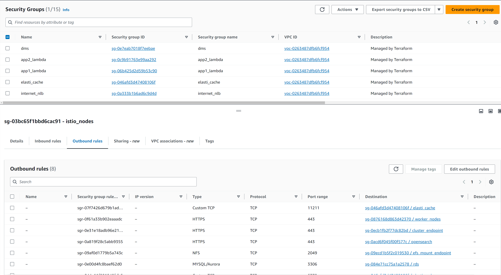

# terraform-aws-security-group-eks-module
- [Overview](#overview)
- [Project Structure](#project-structure)
- [Usage](#usage)
- [Prerequisites](#prerequisites)
- [TO DO](#to-do)
- [Test Cases](#test-cases)
- [Mermaid](#mermaid)
- [Contributing](#contributing)
- [Disclaimer](#disclaimer)
- [License](#license)



# Overview
- Generate AWS security-group configuration in a single module using json files converted from traditional csv dataflow templates. 
- Python manages state of json files used for Terraform to build rules. 

# Project Structure
```
terraform-aws-sg-module-template/
├── main.tf
├── providers.tf
├── variables.tf
├── sg_rules/
│   ├── egress/
│   │   ├── aws_security_group.sgs[each.value.name]-egress.json
│   │   ├── ...
│   ├── ingress/
│   │   ├── aws_security_group.sgs[each.value.name]-ingress.json
│   │   ├── ...
└── README.md
```


# Usage
- Define firewall rules in firewall_rules.csv
- Run rule_conversion.py (for first time or after making changes to firewall_rules.csv)
- Terraform apply

## Prerequisites
```
AWS_ACCESS_KEY_ID
AWS_SECRET_ACCESS_KEY
BUCKET_ACCESS_KEY_ID
BUCKET_ENDPOINT
BUCKET_KEY
BUCKET_NAME
BUCKET_SECRET_ACCESS_KEY
```

# TO DO

- Incorporate per service [vpce-sg-module](https://github.com/drewpypro/aws-vpce-policy-tester/tree/main/modulev2)
- Incorporate cidr_ipv4 and cidr_ipv6 leveraging list variables. 
- Incorporate into [aws-eks-drewpy](https://github.com/drewpypro/aws-eks-drewpy)

# Test Cases

## Successful first time [apply](https://github.com/drewpypro/terraform-aws-sg-module-template/actions/runs/12074651948/job/33673022659) 

## Adding new rules to existing sg
  - appended these lines to firewall_rules.csv
    ```
    worker_nodes,worker_nodes,egress,1433,1433,tcp,rds
    rds,rds,ingress,1433,1433,tcp,worker_nodes
    ```
  - reran python script to update rule state
    ```
    python3 rule_conversion.py 
    No changes: ./sg_rules/ingress/cluster_endpoint_ingress.json
    No changes: ./sg_rules/ingress/efs_mount_endpoint_ingress.json
    No changes: ./sg_rules/ingress/elasti_cache_ingress.json
    No changes: ./sg_rules/ingress/internet_istio_nodes_ingress.json
    No changes: ./sg_rules/ingress/istio_nodes_ingress.json
    No changes: ./sg_rules/ingress/msk_ingress.json
    No changes: ./sg_rules/ingress/opensearch_ingress.json
    Updated: ./sg_rules/ingress/rds_ingress.json
    No changes: ./sg_rules/ingress/worker_nodes_ingress.json
    No changes: ./sg_rules/egress/app1_lambda_egress.json
    No changes: ./sg_rules/egress/app2_lambda_egress.json
    No changes: ./sg_rules/egress/dms_egress.json
    No changes: ./sg_rules/egress/internet_istio_nodes_egress.json
    No changes: ./sg_rules/egress/internet_nlb_egress.json
    No changes: ./sg_rules/egress/istio_nodes_egress.json
    No changes: ./sg_rules/egress/nlb_egress.json
    Updated: ./sg_rules/egress/worker_nodes_egress.json
    JSON files have been synchronized in ./sg_rules
    Successfully updated README.md with new security group diagram!
    ```
  - Submitted [PR#14](https://github.com/drewpypro/terraform-aws-sg-module-template/pull/14)
  - Successful [Apply](https://github.com/drewpypro/terraform-aws-sg-module-template/actions/runs/12074673918/job/33673086770)

## Adding new SG and new SG rules
  - Updated main.tf, firewall_rules.csv and rule_conversion.py as indicated in [PR#16](https://github.com/drewpypro/terraform-aws-sg-module-template/pull/16)
  - Generated new rules and diagrams
    ```
    python3 rule_conversion.py 
    No changes: ./sg_rules/ingress/cluster_endpoint_ingress.json
    No changes: ./sg_rules/ingress/efs_mount_endpoint_ingress.json
    No changes: ./sg_rules/ingress/elasti_cache_ingress.json
    No changes: ./sg_rules/ingress/internet_istio_nodes_ingress.json
    No changes: ./sg_rules/ingress/istio_nodes_ingress.json
    No changes: ./sg_rules/ingress/msk_ingress.json
    No changes: ./sg_rules/ingress/opensearch_ingress.json
    No changes: ./sg_rules/ingress/rds_ingress.json
    Updated: ./sg_rules/ingress/worker_nodes_ingress.json
    No changes: ./sg_rules/egress/app1_lambda_egress.json
    No changes: ./sg_rules/egress/app2_lambda_egress.json
    No changes: ./sg_rules/egress/dms_egress.json
    No changes: ./sg_rules/egress/internet_istio_nodes_egress.json
    No changes: ./sg_rules/egress/internet_nlb_egress.json
    No changes: ./sg_rules/egress/istio_nodes_egress.json
    No changes: ./sg_rules/egress/nlb_egress.json
    No changes: ./sg_rules/egress/worker_nodes_egress.json
    JSON files have been synchronized in ./sg_rules
    Successfully updated README.md with new security group diagram!
    ```
  - Submitted [PR#16](https://github.com/drewpypro/terraform-aws-sg-module-template/pull/16)
  - Successful [Apply](https://github.com/drewpypro/terraform-aws-sg-module-template/actions/runs/12074774216/job/33673381627)

## Removing SG 
  - Manually deleted ./sg_rules/egress/sg1_egress.json (need conversion script to delete files)
  - Removed sg1 from rule_conversion.py (mermaid section)
  - Removed sg1 firewall rules from firewall_rules.csv
  - Generated new rules and updated diagram
    ```
    python3 rule_conversion.py 
    No changes: ./sg_rules/ingress/cluster_endpoint_ingress.json
    No changes: ./sg_rules/ingress/efs_mount_endpoint_ingress.json
    No changes: ./sg_rules/ingress/elasti_cache_ingress.json
    No changes: ./sg_rules/ingress/internet_istio_nodes_ingress.json
    No changes: ./sg_rules/ingress/istio_nodes_ingress.json
    No changes: ./sg_rules/ingress/msk_ingress.json
    No changes: ./sg_rules/ingress/opensearch_ingress.json
    No changes: ./sg_rules/ingress/rds_ingress.json
    Updated: ./sg_rules/ingress/worker_nodes_ingress.json
    No changes: ./sg_rules/egress/app1_lambda_egress.json
    No changes: ./sg_rules/egress/app2_lambda_egress.json
    No changes: ./sg_rules/egress/dms_egress.json
    No changes: ./sg_rules/egress/internet_istio_nodes_egress.json
    No changes: ./sg_rules/egress/internet_nlb_egress.json
    No changes: ./sg_rules/egress/istio_nodes_egress.json
    No changes: ./sg_rules/egress/nlb_egress.json
    No changes: ./sg_rules/egress/worker_nodes_egress.json
    JSON files have been synchronized in ./sg_rules
    Successfully updated README.md with new security group diagram!
    ```
  - Submitted [PR#17](https://github.com/drewpypro/terraform-aws-sg-module-template/pull/17)
  - Successful [Apply](https://github.com/drewpypro/terraform-aws-sg-module-template/actions/runs/12074861670/job/33673634957)

## Removing SG rules
  - Remove Bad rule in firewall_rules.csv
    ```
    name,security_group_id,direction,from_port,to_port,ip_protocol,referenced_security_group_id
    internet_istio_nodes,internet_istio_nodes,egress,2049,2049,tcp,efs_mount_endpoint
    ```
  - Generate new rules and update diagrams
    ```
    python3 rule_conversion.py 
    No changes: ./sg_rules/ingress/cluster_endpoint_ingress.json
    No changes: ./sg_rules/ingress/efs_mount_endpoint_ingress.json
    No changes: ./sg_rules/ingress/elasti_cache_ingress.json
    No changes: ./sg_rules/ingress/internet_istio_nodes_ingress.json
    No changes: ./sg_rules/ingress/istio_nodes_ingress.json
    No changes: ./sg_rules/ingress/msk_ingress.json
    No changes: ./sg_rules/ingress/opensearch_ingress.json
    No changes: ./sg_rules/ingress/rds_ingress.json
    No changes: ./sg_rules/ingress/worker_nodes_ingress.json
    No changes: ./sg_rules/egress/app1_lambda_egress.json
    No changes: ./sg_rules/egress/app2_lambda_egress.json
    No changes: ./sg_rules/egress/dms_egress.json
    Updated: ./sg_rules/egress/internet_istio_nodes_egress.json
    No changes: ./sg_rules/egress/internet_nlb_egress.json
    No changes: ./sg_rules/egress/istio_nodes_egress.json
    No changes: ./sg_rules/egress/nlb_egress.json
    No changes: ./sg_rules/egress/worker_nodes_egress.json
    JSON files have been synchronized in ./sg_rules
    Successfully updated README.md with new security group diagram!
    ```
  - Submitted [PR#18](https://github.com/drewpypro/terraform-aws-sg-module-template/pull/18)
  - Successful [Apply](https://github.com/drewpypro/terraform-aws-sg-module-template/actions/runs/12074918889/job/33673794002)


# Mermaid 

```mermaid
flowchart LR
    %% Styles
    classDef default fill:#1a2433,stroke:#fff,stroke-width:2px,color:#fff
    classDef lb fill:#d86613,stroke:#fff,stroke-width:2px,color:#fff
    classDef nodes fill:#007acc,stroke:#fff,stroke-width:2px,color:#fff
    classDef data fill:#3b48cc,stroke:#fff,stroke-width:2px,color:#fff
    classDef infra fill:#c94f17,stroke:#fff,stroke-width:2px,color:#fff

    %% General Subnet
    subgraph general_subnet [General Subnet]
        rds[Rds<br>1433,3306]
        msk[Msk<br>9096]
        opensearch[Opensearch<br>443]
        elasti_cache[Elasti Cache<br>11211,6379]
        efs_mount_endpoint[Efs Mount Endpoint<br>2049]
        dms[Dms<br>3306]
    end

    %% Paas Subnet
    subgraph paas_subnet [Paas Subnet]
        istio_nodes[Istio Nodes<br>11211,2049,30000-40000,3306,443,6379,9096]
        internet_istio_nodes[Internet Istio Nodes<br>11211,30000-40000,3306,443,6379,9096]
        worker_nodes[Worker Nodes<br>11211,1433,2049,3306,443,6379,9096]
        cluster_endpoint[Cluster Endpoint<br>443]
    end

    %% Lambda Subnet
    subgraph lambda_subnet [Lambda Subnet]
        app1_lambda[App1 Lambda<br>443]
        app2_lambda[App2 Lambda<br>3306]
    end

    %% Nlb Subnet
    subgraph nlb_subnet [Nlb Subnet]
        nlb[Nlb<br>30000-40000,443]
    end

    %% Internet Nlb Subnet
    subgraph internet_nlb_subnet [Internet Nlb Subnet]
        internet_nlb[Internet Nlb<br>30000-40000,443]
    end

    %% Connections
    app1_lambda --> |443| internet_istio_nodes
    app1_lambda --> |443| istio_nodes
    app1_lambda --> |443| worker_nodes
    app2_lambda --> |3306| rds
    cluster_endpoint --> |443| internet_istio_nodes
    cluster_endpoint --> |443| istio_nodes
    cluster_endpoint --> |443| worker_nodes
    dms --> |3306| rds
    efs_mount_endpoint --> |2049| istio_nodes
    efs_mount_endpoint --> |2049| worker_nodes
    elasti_cache --> |11211| istio_nodes
    elasti_cache --> |6379| istio_nodes
    elasti_cache --> |11211| worker_nodes
    elasti_cache --> |6379| worker_nodes
    internet_istio_nodes --> |443| app1_lambda
    internet_istio_nodes --> |443| cluster_endpoint
    internet_istio_nodes --> |11211| elasti_cache
    internet_istio_nodes --> |6379| elasti_cache
    internet_istio_nodes --> |443| internet_nlb
    internet_istio_nodes --> |30000-40000| internet_nlb
    internet_istio_nodes --> |9096| msk
    internet_istio_nodes --> |443| opensearch
    internet_istio_nodes --> |3306| rds
    internet_istio_nodes --> |443| worker_nodes
    internet_nlb --> |443| internet_istio_nodes
    internet_nlb --> |30000-40000| internet_istio_nodes
    istio_nodes --> |443| app1_lambda
    istio_nodes --> |443| cluster_endpoint
    istio_nodes --> |2049| efs_mount_endpoint
    istio_nodes --> |11211| elasti_cache
    istio_nodes --> |6379| elasti_cache
    istio_nodes --> |9096| msk
    istio_nodes --> |443| nlb
    istio_nodes --> |443| opensearch
    istio_nodes --> |3306| rds
    istio_nodes --> |443| worker_nodes
    msk --> |9096| internet_istio_nodes
    msk --> |9096| istio_nodes
    msk --> |9096| worker_nodes
    nlb --> |443| istio_nodes
    nlb --> |30000-40000| istio_nodes
    opensearch --> |443| internet_istio_nodes
    opensearch --> |443| istio_nodes
    opensearch --> |443| worker_nodes
    rds --> |3306| internet_istio_nodes
    rds --> |3306| istio_nodes
    rds --> |3306| worker_nodes
    worker_nodes --> |443| app1_lambda
    worker_nodes --> |443| cluster_endpoint
    worker_nodes --> |2049| efs_mount_endpoint
    worker_nodes --> |11211| elasti_cache
    worker_nodes --> |6379| elasti_cache
    worker_nodes --> |443| istio_nodes
    worker_nodes --> |9096| msk
    worker_nodes --> |443| opensearch
    worker_nodes --> |3306| rds
    worker_nodes --> |1433| rds
    rds --> |1433| worker_nodes

    %% Apply styles
    class internet_nlb,nlb lb
    class internet_istio_nodes,istio_nodes,worker_nodes,app1_lambda,app2_lambda nodes
    class rds,msk,opensearch,elasti_cache data
    class cluster_endpoint,efs_mount_endpoint,dms infra
```

<!-- SECURITY_GROUP_DIAGRAM_START -->

<!-- SECURITY_GROUP_DIAGRAM_END -->
