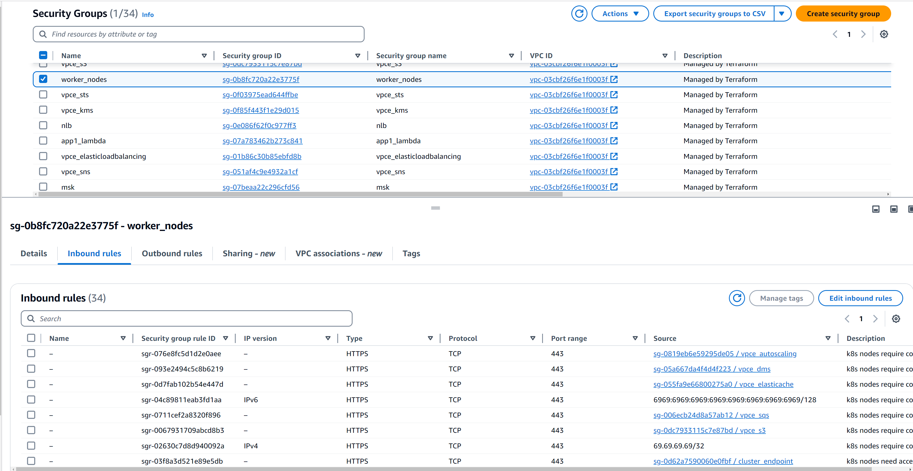
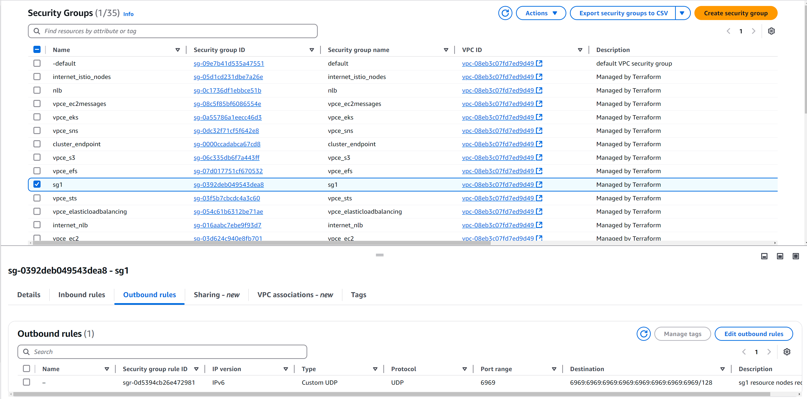

# terraform-aws-security-group-eks-module
- [Overview](#overview)
- [Project Structure](#project-structure)
- [Usage](#usage)
- [Prerequisites](#prerequisites)
- [TO DO](#to-do)
- [Test Cases](#test-cases)
- [Contributing](#contributing)
- [Disclaimer](#disclaimer)
- [License](#license)
- [Mermaid](#mermaid)

# Overview
- Generate AWS security-group configuration in a single module using json files converted from traditional csv dataflow templates
- Python manages state of json files used for Terraform to build rules

# Project Structure
```
terraform-aws-sg-module-template/
├── main.tf
├── providers.tf
├── variables.tf
├── sg_rules/
│   ├── aws_security_group.sgs[each.value.name].json
├── firewall_rules.csv
├── rule_conversion.py
└── README.md
```

# Usage
- Define firewall rules in [firewall_rules.csv](https://github.com/drewpypro/terraform-aws-sg-module-template/blob/main/firewall_rules.csv)
- Run [rule_conversion.py](https://github.com/drewpypro/terraform-aws-sg-module-template/blob/main/rule_conversion.py)
- Terraform apply

## Prerequisites
```
AWS_ACCESS_KEY_ID
AWS_SECRET_ACCESS_KEY
BUCKET_ACCESS_KEY_ID
BUCKET_ENDPOINT
BUCKET_KEY
BUCKET_NAME
BUCKET_SECRET_ACCESS_KEY
```

# TO DO

- Make conversion script remove files (if SG is deleted)
- Incorporate into [aws-eks-drewpy](https://github.com/drewpypro/aws-eks-drewpy)
- Make mermaid better
- Custom Rules (If this is being used as a shared template module)

# Test Cases

## Successful first build
<details>
  <summary>First time python conversion</summary>

```
python3 rule_conversion.py 
Updated: ./sg_rules/cluster_endpoint.json
Updated: ./sg_rules/efs_mount_endpoint.json
Updated: ./sg_rules/elasti_cache.json
Updated: ./sg_rules/internet_istio_nodes.json
Updated: ./sg_rules/internet_nlb.json
Updated: ./sg_rules/istio_nodes.json
Updated: ./sg_rules/msk.json
Updated: ./sg_rules/nlb.json
Updated: ./sg_rules/opensearch.json
Updated: ./sg_rules/rds.json
Updated: ./sg_rules/vpce_autoscaling.json
Updated: ./sg_rules/vpce_dms.json
Updated: ./sg_rules/vpce_ec2.json
Updated: ./sg_rules/vpce_ec2messages.json
Updated: ./sg_rules/vpce_efs.json
Updated: ./sg_rules/vpce_eks.json
Updated: ./sg_rules/vpce_elasticache.json
Updated: ./sg_rules/vpce_elasticloadbalancing.json
Updated: ./sg_rules/vpce_kms.json
Updated: ./sg_rules/vpce_lambda.json
Updated: ./sg_rules/vpce_logs.json
Updated: ./sg_rules/vpce_monitoring.json
Updated: ./sg_rules/vpce_rds.json
Updated: ./sg_rules/vpce_s3.json
Updated: ./sg_rules/vpce_sns.json
Updated: ./sg_rules/vpce_sqs.json
Updated: ./sg_rules/vpce_ssm.json
Updated: ./sg_rules/vpce_ssmmessages.json
Updated: ./sg_rules/vpce_sts.json
Updated: ./sg_rules/worker_nodes.json
Updated: ./sg_rules/app1_lambda.json
Updated: ./sg_rules/app2_lambda.json
Updated: ./sg_rules/dms.json
Updated: ./sg_rules/internet_istio_nodes.json
Updated: ./sg_rules/internet_nlb.json
Updated: ./sg_rules/istio_nodes.json
Updated: ./sg_rules/nlb.json
Updated: ./sg_rules/rds.json
Updated: ./sg_rules/worker_nodes.json
JSON files have been synchronized in ./sg_rules
Successfully updated README.md with new security group diagram!
```
</details>

- Submitted [PR#44](https://github.com/drewpypro/terraform-aws-sg-module-template/pull/44)
- Successful [Apply](https://github.com/drewpypro/terraform-aws-sg-module-template/actions/runs/12097780052/job/33733528325)
  - 


## Adding new rules to existing sg
<details>
  <summary>appended these lines to firewall_rules.csv</summary>

```
19543231,worker_nodes,worker_nodes,ingress,6969,6969,udp,worker_nodes,null,null,k8s nodes require connectivity between nodes for geneve tunneling
19543231,worker_nodes,worker_nodes,egress,53,53,tcp,null,192.168.11.53/32,null,k8s nodes require connectivity to bind dns server
19543231,worker_nodes,worker_nodes,egress,6969,6969,udp,null,null,6969:6969:6969:6969:6969:6969:6969:6969/128,k8s nodes require connectivity to external API endpoints
 ```
</details>
<details>
  <summary>reran python script to update rule state</summary>

```
python3 rule_conversion.py 
No changes: ./sg_rules/vpce_lambda.json
No changes: ./sg_rules/vpce_efs.json
No changes: ./sg_rules/vpce_elasticache.json
No changes: ./sg_rules/internet_nlb.json
No changes: ./sg_rules/elasti_cache.json
No changes: ./sg_rules/vpce_sns.json
No changes: ./sg_rules/vpce_monitoring.json
No changes: ./sg_rules/vpce_ec2messages.json
No changes: ./sg_rules/app1_lambda.json
No changes: ./sg_rules/vpce_ssmmessages.json
No changes: ./sg_rules/msk.json
No changes: ./sg_rules/efs_mount_endpoint.json
No changes: ./sg_rules/vpce_dms.json
No changes: ./sg_rules/vpce_rds.json
No changes: ./sg_rules/rds.json
No changes: ./sg_rules/vpce_eks.json
No changes: ./sg_rules/internet_istio_nodes.json
No changes: ./sg_rules/vpce_s3.json
No changes: ./sg_rules/vpce_ec2.json
Updated: ./sg_rules/worker_nodes.json
No changes: ./sg_rules/vpce_logs.json
No changes: ./sg_rules/vpce_ssm.json
No changes: ./sg_rules/cluster_endpoint.json
No changes: ./sg_rules/vpce_kms.json
No changes: ./sg_rules/vpce_sqs.json
No changes: ./sg_rules/vpce_elasticloadbalancing.json
No changes: ./sg_rules/dms.json
No changes: ./sg_rules/istio_nodes.json
No changes: ./sg_rules/opensearch.json
No changes: ./sg_rules/vpce_autoscaling.json
No changes: ./sg_rules/vpce_sts.json
No changes: ./sg_rules/nlb.json
No changes: ./sg_rules/app2_lambda.json
JSON files have been synchronized in ./sg_rules
Successfully updated README.md with new security group diagram!
```
</details>

- Submitted [PR#56](https://github.com/drewpypro/terraform-aws-sg-module-template/pull/47)
- Successful [Apply](https://github.com/drewpypro/terraform-aws-sg-module-template/actions/runs/12101692358/job/33741831165)
  - 

## Adding new SG and new SG rules
- Added new "sg1" local to main.tf
<details>
  <summary>added new sg1 rules to firewall_rules.csv</summary>

```
19543694,sg1,sg1,egress,6969,6969,udp,null,null,6969:6969:6969:6969:6969:6969:6969:6969/128,sg1 resource nodes require connectivity to external API endpoints
```

</details>
<details>
  <summary>Generated new rules and diagrams</summary>

```
python3 rule_conversion.py 
No changes: ./sg_rules/vpce_sqs.json
No changes: ./sg_rules/app1_lambda.json
No changes: ./sg_rules/vpce_ec2.json
No changes: ./sg_rules/efs_mount_endpoint.json
No changes: ./sg_rules/cluster_endpoint.json
No changes: ./sg_rules/elasti_cache.json
No changes: ./sg_rules/vpce_ec2messages.json
No changes: ./sg_rules/vpce_ssmmessages.json
No changes: ./sg_rules/vpce_sns.json
No changes: ./sg_rules/opensearch.json
No changes: ./sg_rules/internet_istio_nodes.json
No changes: ./sg_rules/app2_lambda.json
No changes: ./sg_rules/vpce_kms.json
No changes: ./sg_rules/dms.json
No changes: ./sg_rules/vpce_elasticache.json
No changes: ./sg_rules/vpce_logs.json
No changes: ./sg_rules/vpce_sts.json
No changes: ./sg_rules/vpce_elasticloadbalancing.json
No changes: ./sg_rules/vpce_autoscaling.json
No changes: ./sg_rules/vpce_dms.json
Updated: ./sg_rules/sg1.json
No changes: ./sg_rules/nlb.json
No changes: ./sg_rules/vpce_rds.json
No changes: ./sg_rules/vpce_eks.json
No changes: ./sg_rules/internet_nlb.json
No changes: ./sg_rules/vpce_lambda.json
No changes: ./sg_rules/istio_nodes.json
No changes: ./sg_rules/rds.json
No changes: ./sg_rules/vpce_efs.json
No changes: ./sg_rules/vpce_ssm.json
No changes: ./sg_rules/msk.json
No changes: ./sg_rules/vpce_monitoring.json
No changes: ./sg_rules/worker_nodes.json
No changes: ./sg_rules/vpce_s3.json
JSON files have been synchronized in ./sg_rules
Successfully updated README.md with new security group diagram!
```
</details>

- Submitted [PR#57](https://github.com/drewpypro/terraform-aws-sg-module-template/pull/57)
- Successful [Apply#1](https://github.com/drewpypro/terraform-aws-sg-module-template/actions/runs/12101755646/job/33741967820)
    - 

## Removing SG 
- Manually deleted ./sg_rules/sg1.json (need conversion script to delete files)
<details>
  <summary>Removed sg1 firewall rules from firewall_rules.csv</summary>

```
19543694,sg1,sg1,egress,6969,6969,udp,null,null,6969:6969:6969:6969:6969:6969:6969:6969/128,sg1 resource nodes require connectivity to external API endpoints 
```
</details>

<details>
  <summary>Generated new rules and updated diagram</summary>

```
python3 rule_conversion.py
No changes: ./sg_rules/efs_mount_endpoint.json
No changes: ./sg_rules/vpce_elasticache.json
No changes: ./sg_rules/internet_istio_nodes.json
No changes: ./sg_rules/app2_lambda.json
No changes: ./sg_rules/vpce_efs.json
No changes: ./sg_rules/vpce_elasticloadbalancing.json
No changes: ./sg_rules/vpce_sts.json
No changes: ./sg_rules/vpce_ec2.json
No changes: ./sg_rules/vpce_eks.json
No changes: ./sg_rules/vpce_dms.json
No changes: ./sg_rules/vpce_monitoring.json
No changes: ./sg_rules/vpce_ssmmessages.json
No changes: ./sg_rules/vpce_rds.json
No changes: ./sg_rules/istio_nodes.json
No changes: ./sg_rules/vpce_s3.json
No changes: ./sg_rules/nlb.json
No changes: ./sg_rules/worker_nodes.json
No changes: ./sg_rules/vpce_sqs.json
No changes: ./sg_rules/vpce_autoscaling.json
No changes: ./sg_rules/msk.json
No changes: ./sg_rules/vpce_kms.json
No changes: ./sg_rules/vpce_logs.json
No changes: ./sg_rules/vpce_ssm.json
No changes: ./sg_rules/dms.json
No changes: ./sg_rules/elasti_cache.json
No changes: ./sg_rules/app1_lambda.json
No changes: ./sg_rules/vpce_sns.json
No changes: ./sg_rules/opensearch.json
No changes: ./sg_rules/cluster_endpoint.json
No changes: ./sg_rules/vpce_lambda.json
No changes: ./sg_rules/rds.json
No changes: ./sg_rules/vpce_ec2messages.json
No changes: ./sg_rules/internet_nlb.json
JSON files have been synchronized in ./sg_rules
No changes detected, README.md was not updated.
```
</details>

- Submitted [PR#37](https://github.com/drewpypro/terraform-aws-sg-module-template/pull/37)
- Successful [Apply](https://github.com/drewpypro/terraform-aws-sg-module-template/actions/runs/12089605572/job/33715178401)
    - 

## Removing SG rules
<details>
  <summary>Remove Bad rule in firewall_rules.csv</summary>

  ```
  RequestID,name,security_group_id,self_rule,direction,from_port,to_port,ip_protocol,referenced_security_group_id,cidr_ipv4,cidr_ipv6,business_justification
  19493892,internet_istio_nodes,internet_istio_nodes,null,egress,2049,2049,tcp,efs_mount_endpoint,null,null,k8s nodes need access to efs for storage mounts used by containers
  ```
</details>
<details>
  <summary>Generate new rules and update diagrams</summary>
    
  ```
  python3 rule_conversion.py 
  No changes: ./sg_rules/ingress/cluster_endpoint_ingress.json
  No changes: ./sg_rules/ingress/efs_mount_endpoint_ingress.json
  No changes: ./sg_rules/ingress/elasti_cache_ingress.json
  No changes: ./sg_rules/ingress/internet_istio_nodes_ingress.json
  No changes: ./sg_rules/ingress/internet_nlb_ingress.json
  No changes: ./sg_rules/ingress/istio_nodes_ingress.json
  No changes: ./sg_rules/ingress/msk_ingress.json
  No changes: ./sg_rules/ingress/nlb_ingress.json
  No changes: ./sg_rules/ingress/opensearch_ingress.json
  No changes: ./sg_rules/ingress/rds_ingress.json
  No changes: ./sg_rules/ingress/vpce_autoscaling_ingress.json
  No changes: ./sg_rules/ingress/vpce_dms_ingress.json
  No changes: ./sg_rules/ingress/vpce_ec2_ingress.json
  No changes: ./sg_rules/ingress/vpce_ec2messages_ingress.json
  No changes: ./sg_rules/ingress/vpce_efs_ingress.json
  No changes: ./sg_rules/ingress/vpce_eks_ingress.json
  No changes: ./sg_rules/ingress/vpce_elasticache_ingress.json
  No changes: ./sg_rules/ingress/vpce_elasticloadbalancing_ingress.json
  No changes: ./sg_rules/ingress/vpce_kms_ingress.json
  No changes: ./sg_rules/ingress/vpce_lambda_ingress.json
  No changes: ./sg_rules/ingress/vpce_logs_ingress.json
  No changes: ./sg_rules/ingress/vpce_monitoring_ingress.json
  No changes: ./sg_rules/ingress/vpce_rds_ingress.json
  No changes: ./sg_rules/ingress/vpce_s3_ingress.json
  No changes: ./sg_rules/ingress/vpce_sns_ingress.json
  No changes: ./sg_rules/ingress/vpce_sqs_ingress.json
  No changes: ./sg_rules/ingress/vpce_ssm_ingress.json
  No changes: ./sg_rules/ingress/vpce_ssmmessages_ingress.json
  No changes: ./sg_rules/ingress/vpce_sts_ingress.json
  No changes: ./sg_rules/ingress/worker_nodes_ingress.json
  No changes: ./sg_rules/egress/app1_lambda_egress.json
  No changes: ./sg_rules/egress/app2_lambda_egress.json
  No changes: ./sg_rules/egress/dms_egress.json
  Updated: ./sg_rules/egress/internet_istio_nodes_egress.json
  No changes: ./sg_rules/egress/internet_nlb_egress.json
  No changes: ./sg_rules/egress/istio_nodes_egress.json
  No changes: ./sg_rules/egress/nlb_egress.json
  No changes: ./sg_rules/egress/worker_nodes_egress.json
  JSON files have been synchronized in ./sg_rules
  Successfully updated README.md with new security group diagram!
  ```
</details>

- Submitted [PR#38](https://github.com/drewpypro/terraform-aws-sg-module-template/pull/38)
- Successful [Apply](https://github.com/drewpypro/terraform-aws-sg-module-template/actions/runs/12089661057/job/33715333186)
      - 

# Contributing

- Fork the repository.
- Create a new branch for your feature or bugfix.
- Make your changes and test them thoroughly.
- Submit a pull request for review.

# Disclaimer

This project is provided "as is" without warranty of any kind, express or implied, including but not limited to the warranties of merchantability, fitness for a particular purpose, and noninfringement. Use this project at your own risk. The maintainers of this repository are not responsible for any damage or issues arising from its use.

# License

This project is licensed under the MIT License. This means you are free to use, modify, and distribute the code as long as credit is given to the original author.

```
Copyright (c) 2024 drewpypro

Permission is hereby granted, free of charge, to any person obtaining a copy
of this software and associated documentation files (the "Software"), to deal
in the Software without restriction, including without limitation the rights
to use, copy, modify, merge, publish, distribute, sublicense, and/or sell
copies of the Software, and to permit persons to whom the Software is
furnished to do so, subject to the following conditions:

The above copyright notice and this permission notice shall be included in all
copies or substantial portions of the Software.
```

# Mermaid 

```mermaid
flowchart LR
    %% Styles
    classDef default fill:#1a2433,stroke:#fff,stroke-width:2px,color:#fff
    classDef lb fill:#d86613,stroke:#fff,stroke-width:2px,color:#fff
    classDef nodes fill:#007acc,stroke:#fff,stroke-width:2px,color:#fff
    classDef data fill:#3b48cc,stroke:#fff,stroke-width:2px,color:#fff
    classDef infra fill:#c94f17,stroke:#fff,stroke-width:2px,color:#fff
    classDef external fill:#454545,stroke:#fff,stroke-width:2px,color:#fff

    %% General Subnet Subnet
    subgraph general_subnet [General Subnet]
        rds[Rds]
        msk[Msk]
        opensearch[Opensearch]
        elasti_cache[Elasti Cache]
        efs_mount_endpoint[Efs Mount Endpoint]
        dms[Dms]
    end

    %% Paas Subnet Subnet
    subgraph paas_subnet [Paas Subnet]
        istio_nodes[Istio Nodes]
        internet_istio_nodes[Internet Istio Nodes]
        worker_nodes[Worker Nodes]
        cluster_endpoint[Cluster Endpoint]
    end

    %% Lambda Subnet Subnet
    subgraph lambda_subnet [Lambda Subnet]
        app1_lambda[App1 Lambda]
        app2_lambda[App2 Lambda]
    end

    %% Nlb Subnet Subnet
    subgraph nlb_subnet [Nlb Subnet]
        nlb[Nlb]
    end

    %% Internet Nlb Subnet Subnet
    subgraph internet_nlb_subnet [Internet Nlb Subnet]
        internet_nlb[Internet Nlb]
    end

    %% Vpce Subnet Subnet
    subgraph vpce_subnet [Vpce Subnet]
        vpce_autoscaling[Vpce Autoscaling]
        vpce_dms[Vpce Dms]
        vpce_ec2[Vpce Ec2]
        vpce_ec2messages[Vpce Ec2Messages]
        vpce_efs[Vpce Efs]
        vpce_eks[Vpce Eks]
        vpce_elasticache[Vpce Elasticache]
        vpce_elasticloadbalancing[Vpce Elasticloadbalancing]
        vpce_kms[Vpce Kms]
        vpce_lambda[Vpce Lambda]
        vpce_logs[Vpce Logs]
        vpce_monitoring[Vpce Monitoring]
        vpce_rds[Vpce Rds]
        vpce_s3[Vpce S3]
        vpce_sns[Vpce Sns]
        vpce_sqs[Vpce Sqs]
        vpce_sts[Vpce Sts]
        vpce_ssm[Vpce Ssm]
        vpce_ssmmessages[Vpce Ssmmessages]
        vpce_sts[Vpce Sts]
    end

    %% External Networks
    subgraph external_networks [External Networks]
        cidr_10.69.69.0_24[10.69.69.0/24]
        cidr_103.21.244.0_22[103.21.244.0/22]
        cidr_103.22.200.0_22[103.22.200.0/22]
        cidr_103.31.4.0_22[103.31.4.0/22]
        cidr_104.16.0.0_13[104.16.0.0/13]
        cidr_104.24.0.0_14[104.24.0.0/14]
        cidr_108.162.192.0_18[108.162.192.0/18]
        cidr_131.0.72.0_22[131.0.72.0/22]
        cidr_141.101.64.0_18[141.101.64.0/18]
        cidr_162.158.0.0_15[162.158.0.0/15]
        cidr_172.64.0.0_13[172.64.0.0/13]
        cidr_173.245.48.0_20[173.245.48.0/20]
        cidr_188.114.96.0_20[188.114.96.0/20]
        cidr_190.93.240.0_20[190.93.240.0/20]
        cidr_192.168.11.53_32[192.168.11.53/32]
        cidr_192.168.69.0_24[192.168.69.0/24]
        cidr_197.234.240.0_22[197.234.240.0/22]
        cidr_198.41.128.0_17[198.41.128.0/17]
        cidr_55.55.55.55_32[55.55.55.55/32]
        cidr_69.69.69.69_32[69.69.69.69/32]
        cidr_6969:6969:6969:6969:6969:6969:6969:6969_128[6969:6969:6969:6969:6969:6969:6969:6969/128]
    end

    %% Connections
    app1_lambda --> |443| internet_istio_nodes
    app1_lambda --> |443| istio_nodes
    app1_lambda --> |443| cidr_69.69.69.69_32
    app1_lambda --> |443| worker_nodes
    app2_lambda --> |443| cidr_69.69.69.69_32
    app2_lambda --> |3306| rds
    cluster_endpoint --> |443| internet_istio_nodes
    cluster_endpoint --> |443| istio_nodes
    cluster_endpoint --> |443| cidr_55.55.55.55_32
    cluster_endpoint --> |443| worker_nodes
    dms --> |3306| rds
    dms --> |443| vpce_kms
    dms --> |443| vpce_sts
    efs_mount_endpoint --> |2049| istio_nodes
    efs_mount_endpoint --> |2049| internet_istio_nodes
    efs_mount_endpoint --> |2049| worker_nodes
    elasti_cache --> |11211| istio_nodes
    elasti_cache --> |6379| istio_nodes
    elasti_cache --> |11211| worker_nodes
    elasti_cache --> |6379| worker_nodes
    internet_istio_nodes --> |2049| efs_mount_endpoint
    internet_istio_nodes --> |443| app1_lambda
    internet_istio_nodes --> |443| cluster_endpoint
    internet_istio_nodes --> |11211| elasti_cache
    internet_istio_nodes --> |6379| elasti_cache
    internet_istio_nodes --> |443| internet_nlb
    internet_istio_nodes --> |30000-40000| internet_nlb
    internet_istio_nodes --> |9096| msk
    internet_istio_nodes --> |443| cidr_6969:6969:6969:6969:6969:6969:6969:6969_128
    internet_istio_nodes --> |443| opensearch
    internet_istio_nodes --> |3306| rds
    internet_istio_nodes --> |443| vpce_autoscaling
    internet_istio_nodes --> |443| vpce_dms
    internet_istio_nodes --> |443| vpce_ec2
    internet_istio_nodes --> |443| vpce_ec2messages
    internet_istio_nodes --> |443| vpce_efs
    internet_istio_nodes --> |443| vpce_eks
    internet_istio_nodes --> |443| vpce_elasticache
    internet_istio_nodes --> |443| vpce_elasticloadbalancing
    internet_istio_nodes --> |443| vpce_kms
    internet_istio_nodes --> |443| vpce_lambda
    internet_istio_nodes --> |443| vpce_logs
    internet_istio_nodes --> |443| vpce_monitoring
    internet_istio_nodes --> |443| vpce_rds
    internet_istio_nodes --> |443| vpce_s3
    internet_istio_nodes --> |443| vpce_sns
    internet_istio_nodes --> |443| vpce_sqs
    internet_istio_nodes --> |443| vpce_ssm
    internet_istio_nodes --> |443| vpce_ssmmessages
    internet_istio_nodes --> |443| vpce_sts
    internet_istio_nodes --> |443| worker_nodes
    internet_istio_nodes --> |443| internet_istio_nodes
    internet_istio_nodes --> |10250| internet_istio_nodes
    internet_istio_nodes --> |53| internet_istio_nodes
    internet_nlb --> |443| internet_istio_nodes
    internet_nlb --> |30000-40000| internet_istio_nodes
    internet_nlb --> |443| cidr_103.21.244.0_22
    internet_nlb --> |443| cidr_103.22.200.0_22
    internet_nlb --> |443| cidr_103.31.4.0_22
    internet_nlb --> |443| cidr_104.16.0.0_13
    internet_nlb --> |443| cidr_104.24.0.0_14
    internet_nlb --> |443| cidr_108.162.192.0_18
    internet_nlb --> |443| cidr_131.0.72.0_22
    internet_nlb --> |443| cidr_141.101.64.0_18
    internet_nlb --> |443| cidr_162.158.0.0_15
    internet_nlb --> |443| cidr_172.64.0.0_13
    internet_nlb --> |443| cidr_173.245.48.0_20
    internet_nlb --> |443| cidr_188.114.96.0_20
    internet_nlb --> |443| cidr_190.93.240.0_20
    internet_nlb --> |443| cidr_197.234.240.0_22
    internet_nlb --> |443| cidr_198.41.128.0_17
    istio_nodes --> |443| app1_lambda
    istio_nodes --> |443| cluster_endpoint
    istio_nodes --> |2049| efs_mount_endpoint
    istio_nodes --> |11211| elasti_cache
    istio_nodes --> |6379| elasti_cache
    istio_nodes --> |9096| msk
    istio_nodes --> |443| nlb
    istio_nodes --> |30000-40000| nlb
    istio_nodes --> |443| cidr_6969:6969:6969:6969:6969:6969:6969:6969_128
    istio_nodes --> |443| opensearch
    istio_nodes --> |3306| rds
    istio_nodes --> |443| vpce_autoscaling
    istio_nodes --> |443| vpce_dms
    istio_nodes --> |443| vpce_ec2
    istio_nodes --> |443| vpce_ec2messages
    istio_nodes --> |443| vpce_efs
    istio_nodes --> |443| vpce_eks
    istio_nodes --> |443| vpce_elasticache
    istio_nodes --> |443| vpce_elasticloadbalancing
    istio_nodes --> |443| vpce_kms
    istio_nodes --> |443| vpce_lambda
    istio_nodes --> |443| vpce_logs
    istio_nodes --> |443| vpce_monitoring
    istio_nodes --> |443| vpce_rds
    istio_nodes --> |443| vpce_s3
    istio_nodes --> |443| vpce_sns
    istio_nodes --> |443| vpce_sqs
    istio_nodes --> |443| vpce_ssm
    istio_nodes --> |443| vpce_ssmmessages
    istio_nodes --> |443| vpce_sts
    istio_nodes --> |443| worker_nodes
    istio_nodes --> |443| istio_nodes
    istio_nodes --> |10250| istio_nodes
    istio_nodes --> |53| istio_nodes
    msk --> |9096| internet_istio_nodes
    msk --> |9096| istio_nodes
    msk --> |9096| worker_nodes
    nlb --> |443| istio_nodes
    nlb --> |30000-40000| istio_nodes
    nlb --> |443| cidr_10.69.69.0_24
    nlb --> |443| cidr_192.168.69.0_24
    opensearch --> |443| internet_istio_nodes
    opensearch --> |443| istio_nodes
    opensearch --> |443| worker_nodes
    rds --> |3306| internet_istio_nodes
    rds --> |3306| istio_nodes
    rds --> |3306| worker_nodes
    rds --> |3306| rds
    vpce_autoscaling --> |443| internet_istio_nodes
    vpce_autoscaling --> |443| istio_nodes
    vpce_autoscaling --> |443| cidr_10.69.69.0_24
    vpce_autoscaling --> |443| cidr_192.168.69.0_24
    vpce_autoscaling --> |443| worker_nodes
    vpce_dms --> |443| internet_istio_nodes
    vpce_dms --> |443| istio_nodes
    vpce_dms --> |443| cidr_10.69.69.0_24
    vpce_dms --> |443| cidr_192.168.69.0_24
    vpce_dms --> |443| worker_nodes
    vpce_ec2 --> |443| internet_istio_nodes
    vpce_ec2 --> |443| istio_nodes
    vpce_ec2 --> |443| cidr_10.69.69.0_24
    vpce_ec2 --> |443| cidr_192.168.69.0_24
    vpce_ec2 --> |443| worker_nodes
    vpce_ec2messages --> |443| internet_istio_nodes
    vpce_ec2messages --> |443| istio_nodes
    vpce_ec2messages --> |443| cidr_10.69.69.0_24
    vpce_ec2messages --> |443| cidr_192.168.69.0_24
    vpce_ec2messages --> |443| worker_nodes
    vpce_efs --> |443| internet_istio_nodes
    vpce_efs --> |443| istio_nodes
    vpce_efs --> |443| cidr_10.69.69.0_24
    vpce_efs --> |443| cidr_192.168.69.0_24
    vpce_efs --> |443| worker_nodes
    vpce_eks --> |443| internet_istio_nodes
    vpce_eks --> |443| istio_nodes
    vpce_eks --> |443| cidr_10.69.69.0_24
    vpce_eks --> |443| cidr_192.168.69.0_24
    vpce_eks --> |443| worker_nodes
    vpce_elasticache --> |443| internet_istio_nodes
    vpce_elasticache --> |443| istio_nodes
    vpce_elasticache --> |443| cidr_10.69.69.0_24
    vpce_elasticache --> |443| cidr_192.168.69.0_24
    vpce_elasticache --> |443| worker_nodes
    vpce_elasticloadbalancing --> |443| internet_istio_nodes
    vpce_elasticloadbalancing --> |443| istio_nodes
    vpce_elasticloadbalancing --> |443| cidr_10.69.69.0_24
    vpce_elasticloadbalancing --> |443| cidr_192.168.69.0_24
    vpce_elasticloadbalancing --> |443| worker_nodes
    vpce_kms --> |443| dms
    vpce_kms --> |443| internet_istio_nodes
    vpce_kms --> |443| istio_nodes
    vpce_kms --> |443| cidr_10.69.69.0_24
    vpce_kms --> |443| cidr_192.168.69.0_24
    vpce_kms --> |443| worker_nodes
    vpce_lambda --> |443| internet_istio_nodes
    vpce_lambda --> |443| istio_nodes
    vpce_lambda --> |443| cidr_10.69.69.0_24
    vpce_lambda --> |443| cidr_192.168.69.0_24
    vpce_lambda --> |443| worker_nodes
    vpce_logs --> |443| internet_istio_nodes
    vpce_logs --> |443| istio_nodes
    vpce_logs --> |443| cidr_10.69.69.0_24
    vpce_logs --> |443| cidr_192.168.69.0_24
    vpce_logs --> |443| worker_nodes
    vpce_monitoring --> |443| internet_istio_nodes
    vpce_monitoring --> |443| istio_nodes
    vpce_monitoring --> |443| cidr_10.69.69.0_24
    vpce_monitoring --> |443| cidr_192.168.69.0_24
    vpce_monitoring --> |443| worker_nodes
    vpce_rds --> |443| internet_istio_nodes
    vpce_rds --> |443| istio_nodes
    vpce_rds --> |443| cidr_10.69.69.0_24
    vpce_rds --> |443| cidr_192.168.69.0_24
    vpce_rds --> |443| worker_nodes
    vpce_s3 --> |443| internet_istio_nodes
    vpce_s3 --> |443| istio_nodes
    vpce_s3 --> |443| cidr_10.69.69.0_24
    vpce_s3 --> |443| cidr_192.168.69.0_24
    vpce_s3 --> |443| worker_nodes
    vpce_sns --> |443| internet_istio_nodes
    vpce_sns --> |443| istio_nodes
    vpce_sns --> |443| cidr_10.69.69.0_24
    vpce_sns --> |443| cidr_192.168.69.0_24
    vpce_sns --> |443| worker_nodes
    vpce_sqs --> |443| internet_istio_nodes
    vpce_sqs --> |443| istio_nodes
    vpce_sqs --> |443| cidr_10.69.69.0_24
    vpce_sqs --> |443| cidr_192.168.69.0_24
    vpce_sqs --> |443| worker_nodes
    vpce_ssm --> |443| internet_istio_nodes
    vpce_ssm --> |443| istio_nodes
    vpce_ssm --> |443| cidr_10.69.69.0_24
    vpce_ssm --> |443| cidr_192.168.69.0_24
    vpce_ssm --> |443| worker_nodes
    vpce_ssmmessages --> |443| internet_istio_nodes
    vpce_ssmmessages --> |443| istio_nodes
    vpce_ssmmessages --> |443| cidr_10.69.69.0_24
    vpce_ssmmessages --> |443| cidr_192.168.69.0_24
    vpce_ssmmessages --> |443| worker_nodes
    vpce_sts --> |443| dms
    vpce_sts --> |443| internet_istio_nodes
    vpce_sts --> |443| istio_nodes
    vpce_sts --> |443| cidr_10.69.69.0_24
    vpce_sts --> |443| cidr_192.168.69.0_24
    vpce_sts --> |443| worker_nodes
    worker_nodes --> |443| app1_lambda
    worker_nodes --> |443| cluster_endpoint
    worker_nodes --> |2049| efs_mount_endpoint
    worker_nodes --> |11211| elasti_cache
    worker_nodes --> |6379| elasti_cache
    worker_nodes --> |443| istio_nodes
    worker_nodes --> |9096| msk
    worker_nodes --> |22| cidr_55.55.55.55_32
    worker_nodes --> |443| cidr_6969:6969:6969:6969:6969:6969:6969:6969_128
    worker_nodes --> |443| cidr_69.69.69.69_32
    worker_nodes --> |443| opensearch
    worker_nodes --> |3306| rds
    worker_nodes --> |443| vpce_autoscaling
    worker_nodes --> |443| vpce_dms
    worker_nodes --> |443| vpce_ec2
    worker_nodes --> |443| vpce_ec2messages
    worker_nodes --> |443| vpce_efs
    worker_nodes --> |443| vpce_eks
    worker_nodes --> |443| vpce_elasticache
    worker_nodes --> |443| vpce_elasticloadbalancing
    worker_nodes --> |443| vpce_kms
    worker_nodes --> |443| vpce_lambda
    worker_nodes --> |443| vpce_logs
    worker_nodes --> |443| vpce_monitoring
    worker_nodes --> |443| vpce_rds
    worker_nodes --> |443| vpce_s3
    worker_nodes --> |443| vpce_sns
    worker_nodes --> |443| vpce_sqs
    worker_nodes --> |443| vpce_ssm
    worker_nodes --> |443| vpce_ssmmessages
    worker_nodes --> |443| vpce_sts
    worker_nodes --> |443| worker_nodes
    worker_nodes --> |10250| worker_nodes
    worker_nodes --> |53| worker_nodes
    worker_nodes --> |6969| worker_nodes
    worker_nodes --> |53| cidr_192.168.11.53_32
    worker_nodes --> |6969| cidr_6969:6969:6969:6969:6969:6969:6969:6969_128

    %% Apply styles
    class internet_nlb,nlb lb
    class internet_istio_nodes,istio_nodes,worker_nodes,app1_lambda,app2_lambda nodes
    class rds,msk,opensearch,elasti_cache data
    class cluster_endpoint,efs_mount_endpoint,dms infra
    class vpce_autoscaling,vpce_dms,vpce_ec2,vpce_ec2messages,vpce_efs,vpce_eks,vpce_elasticache,vpce_elasticloadbalancing,vpce_kms,vpce_lambda,vpce_logs,vpce_monitoring,vpce_rds,vpce_s3,vpce_sns,vpce_sqs,vpce_sts,vpce_ssm,vpce_ssmmessages,vpce_sts infra
    class cidr_103.22.200.0_22,cidr_103.31.4.0_22,cidr_69.69.69.69_32,cidr_141.101.64.0_18,cidr_104.24.0.0_14,cidr_6969:6969:6969:6969:6969:6969:6969:6969_128,cidr_10.69.69.0_24,cidr_188.114.96.0_20,cidr_108.162.192.0_18,cidr_103.21.244.0_22,cidr_173.245.48.0_20,cidr_192.168.69.0_24,cidr_162.158.0.0_15,cidr_198.41.128.0_17,cidr_104.16.0.0_13,cidr_190.93.240.0_20,cidr_131.0.72.0_22,cidr_172.64.0.0_13,cidr_55.55.55.55_32,cidr_197.234.240.0_22,cidr_192.168.11.53_32 external
```

<!-- SECURITY_GROUP_DIAGRAM_START -->

<!-- SECURITY_GROUP_DIAGRAM_END -->
