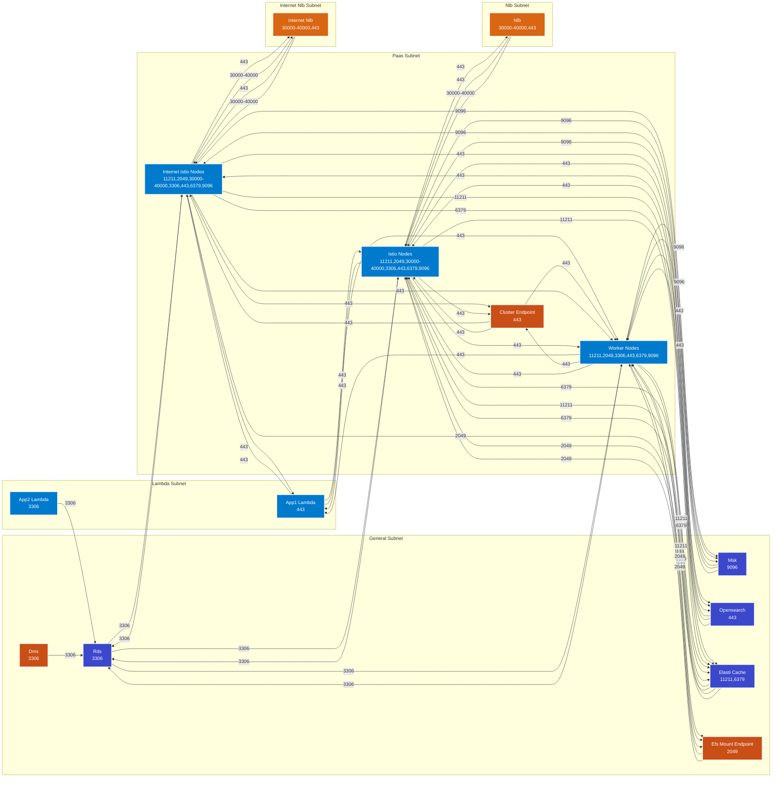

# terraform-aws-security-group-eks-module


# Overview
- Generate AWS security-group configuration in a single module using json files converted from traditional csv dataflow templates. 
- Python manages state of json files used for Terraform to build rules. 


# Requirements
- Define firewall rules in firewall_rules.csv
- Run rule_conversion.py (for first time or after making changes to firewall_rules.csv)
- Terraform apply

```
terraform-aws-sg-module-template/
├── main.tf
├── providers.tf
├── variables.tf
├── sg_rules/
│   ├── egress/
│   │   ├── aws_security_group.sgs[each.value.name]-egress.json
│   │   ├── ...
│   ├── ingress/
│   │   ├── aws_security_group.sgs[each.value.name]-ingress.json
│   │   ├── ...
└── README.md
```

# TO DO

- Incorporate per service [vpce-sg-module](https://github.com/drewpypro/aws-vpce-policy-tester/tree/main/modulev2)
- Incorporate cidr_ipv4 and cidr_ipv6 leveraging list variables. 
- Incorporate into [aws-eks-drewpy](https://github.com/drewpypro/aws-eks-drewpy)


# Tests

- Successful first time [run](https://github.com/drewpypro/terraform-aws-sg-module-template/actions/runs/12074231390/job/33671844485) 
- Adding new rules to existing sg
  - appended these lines to firewall_rules.csv
  ```
  worker_nodes,worker_nodes,egress,1433,1433,tcp,rds
  rds,rds,ingress,1433,1433,tcp,worker_nodes
  ```

  - reran python script to update rule state
  ```
  python3 rule_conversion.py 
  No changes: ./sg_rules/ingress/cluster_endpoint_ingress.json
  No changes: ./sg_rules/ingress/efs_mount_endpoint_ingress.json
  No changes: ./sg_rules/ingress/elasti_cache_ingress.json
  No changes: ./sg_rules/ingress/internet_istio_nodes_ingress.json
  No changes: ./sg_rules/ingress/istio_nodes_ingress.json
  No changes: ./sg_rules/ingress/msk_ingress.json
  No changes: ./sg_rules/ingress/opensearch_ingress.json
  Updated: ./sg_rules/ingress/rds_ingress.json
  No changes: ./sg_rules/ingress/worker_nodes_ingress.json
  No changes: ./sg_rules/egress/app1_lambda_egress.json
  No changes: ./sg_rules/egress/app2_lambda_egress.json
  No changes: ./sg_rules/egress/dms_egress.json
  No changes: ./sg_rules/egress/internet_istio_nodes_egress.json
  No changes: ./sg_rules/egress/internet_nlb_egress.json
  No changes: ./sg_rules/egress/istio_nodes_egress.json
  No changes: ./sg_rules/egress/nlb_egress.json
  Updated: ./sg_rules/egress/worker_nodes_egress.json
  JSON files have been synchronized in ./sg_rules
  ```

  - Submitted [PR#8](https://github.com/drewpypro/terraform-aws-sg-module-template/pull/8)
- Adding new SG and new SG rules
- Removing SG 
- Removing SG rules

# Mermaid (generated by mermaid_creator.py)
<!-- SECURITY_GROUP_DIAGRAM_START -->

<!-- SECURITY_GROUP_DIAGRAM_END -->
