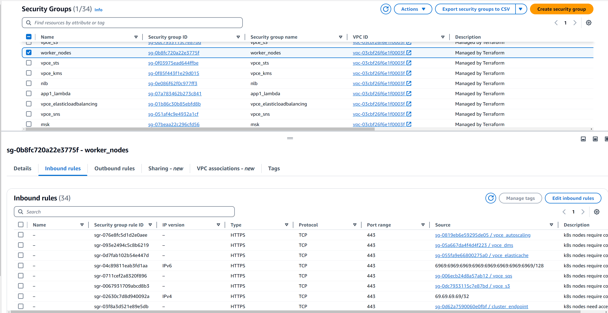
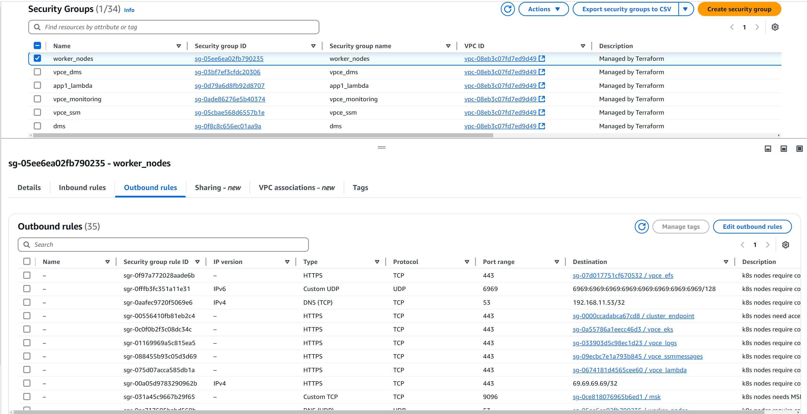
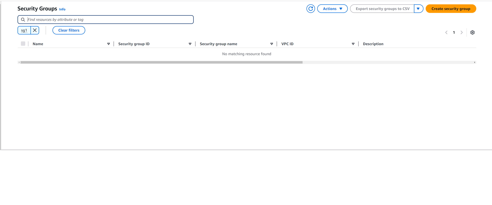
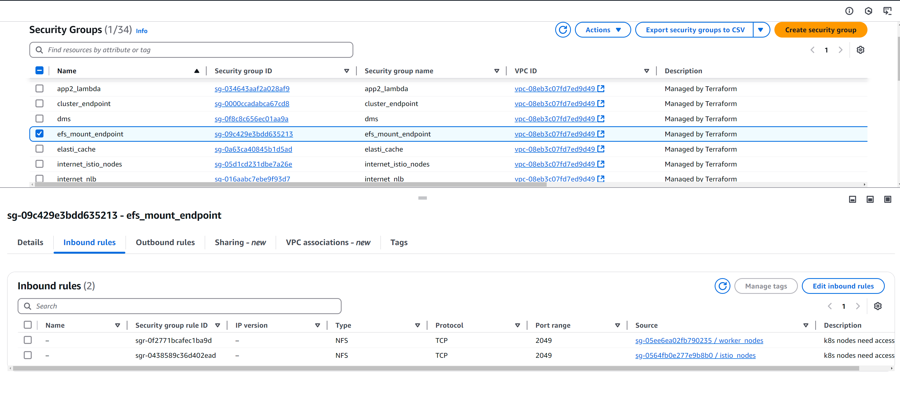

# Test Cases

## Successful first build
<details>
  <summary>First time python conversion</summary>

```
python3 rule_conversion.py 
Updated: ./sg_rules/cluster_endpoint.json
Updated: ./sg_rules/efs_mount_endpoint.json
Updated: ./sg_rules/elasti_cache.json
Updated: ./sg_rules/internet_istio_nodes.json
Updated: ./sg_rules/internet_nlb.json
Updated: ./sg_rules/istio_nodes.json
Updated: ./sg_rules/msk.json
Updated: ./sg_rules/nlb.json
Updated: ./sg_rules/opensearch.json
Updated: ./sg_rules/rds.json
Updated: ./sg_rules/vpce_autoscaling.json
Updated: ./sg_rules/vpce_dms.json
Updated: ./sg_rules/vpce_ec2.json
Updated: ./sg_rules/vpce_ec2messages.json
Updated: ./sg_rules/vpce_efs.json
Updated: ./sg_rules/vpce_eks.json
Updated: ./sg_rules/vpce_elasticache.json
Updated: ./sg_rules/vpce_elasticloadbalancing.json
Updated: ./sg_rules/vpce_kms.json
Updated: ./sg_rules/vpce_lambda.json
Updated: ./sg_rules/vpce_logs.json
Updated: ./sg_rules/vpce_monitoring.json
Updated: ./sg_rules/vpce_rds.json
Updated: ./sg_rules/vpce_s3.json
Updated: ./sg_rules/vpce_sns.json
Updated: ./sg_rules/vpce_sqs.json
Updated: ./sg_rules/vpce_ssm.json
Updated: ./sg_rules/vpce_ssmmessages.json
Updated: ./sg_rules/vpce_sts.json
Updated: ./sg_rules/worker_nodes.json
Updated: ./sg_rules/app1_lambda.json
Updated: ./sg_rules/app2_lambda.json
Updated: ./sg_rules/dms.json
Updated: ./sg_rules/internet_istio_nodes.json
Updated: ./sg_rules/internet_nlb.json
Updated: ./sg_rules/istio_nodes.json
Updated: ./sg_rules/nlb.json
Updated: ./sg_rules/rds.json
Updated: ./sg_rules/worker_nodes.json
JSON files have been synchronized in ./sg_rules
Successfully updated README.md with new security group diagram!
```
</details>

- Submitted [PR#44](https://github.com/drewpypro/terraform-aws-sg-module-template/pull/44)
- Successful [Apply](https://github.com/drewpypro/terraform-aws-sg-module-template/actions/runs/12097780052/job/33733528325)
  - 


## Adding new rules to existing sg
<details>
  <summary>appended these lines to firewall_rules.csv</summary>

```
19543231,worker_nodes,worker_nodes,ingress,6969,6969,udp,worker_nodes,null,null,k8s nodes require connectivity between nodes for geneve tunneling
19543231,worker_nodes,worker_nodes,egress,53,53,tcp,null,192.168.11.53/32,null,k8s nodes require connectivity to bind dns server
19543231,worker_nodes,worker_nodes,egress,6969,6969,udp,null,null,6969:6969:6969:6969:6969:6969:6969:6969/128,k8s nodes require connectivity to external API endpoints
 ```
</details>
<details>
  <summary>reran python script to update rule state</summary>

```
python3 rule_conversion.py 
No changes: ./sg_rules/vpce_lambda.json
No changes: ./sg_rules/vpce_efs.json
No changes: ./sg_rules/vpce_elasticache.json
No changes: ./sg_rules/internet_nlb.json
No changes: ./sg_rules/elasti_cache.json
No changes: ./sg_rules/vpce_sns.json
No changes: ./sg_rules/vpce_monitoring.json
No changes: ./sg_rules/vpce_ec2messages.json
No changes: ./sg_rules/app1_lambda.json
No changes: ./sg_rules/vpce_ssmmessages.json
No changes: ./sg_rules/msk.json
No changes: ./sg_rules/efs_mount_endpoint.json
No changes: ./sg_rules/vpce_dms.json
No changes: ./sg_rules/vpce_rds.json
No changes: ./sg_rules/rds.json
No changes: ./sg_rules/vpce_eks.json
No changes: ./sg_rules/internet_istio_nodes.json
No changes: ./sg_rules/vpce_s3.json
No changes: ./sg_rules/vpce_ec2.json
Updated: ./sg_rules/worker_nodes.json
No changes: ./sg_rules/vpce_logs.json
No changes: ./sg_rules/vpce_ssm.json
No changes: ./sg_rules/cluster_endpoint.json
No changes: ./sg_rules/vpce_kms.json
No changes: ./sg_rules/vpce_sqs.json
No changes: ./sg_rules/vpce_elasticloadbalancing.json
No changes: ./sg_rules/dms.json
No changes: ./sg_rules/istio_nodes.json
No changes: ./sg_rules/opensearch.json
No changes: ./sg_rules/vpce_autoscaling.json
No changes: ./sg_rules/vpce_sts.json
No changes: ./sg_rules/nlb.json
No changes: ./sg_rules/app2_lambda.json
JSON files have been synchronized in ./sg_rules
Successfully updated README.md with new security group diagram!
```
</details>

- Submitted [PR#56](https://github.com/drewpypro/terraform-aws-sg-module-template/pull/47)
- Successful [Apply](https://github.com/drewpypro/terraform-aws-sg-module-template/actions/runs/12101692358/job/33741831165)
  - 

## Adding new SG and new SG rules
- Added new "sg1" local to main.tf
<details>
  <summary>added new sg1 rules to firewall_rules.csv</summary>

```
19543694,sg1,sg1,egress,6969,6969,udp,null,null,6969:6969:6969:6969:6969:6969:6969:6969/128,sg1 resource nodes require connectivity to external API endpoints
```

</details>
<details>
  <summary>Generated new rules and diagrams</summary>

```
python3 rule_conversion.py 
No changes: ./sg_rules/vpce_sqs.json
No changes: ./sg_rules/app1_lambda.json
No changes: ./sg_rules/vpce_ec2.json
No changes: ./sg_rules/efs_mount_endpoint.json
No changes: ./sg_rules/cluster_endpoint.json
No changes: ./sg_rules/elasti_cache.json
No changes: ./sg_rules/vpce_ec2messages.json
No changes: ./sg_rules/vpce_ssmmessages.json
No changes: ./sg_rules/vpce_sns.json
No changes: ./sg_rules/opensearch.json
No changes: ./sg_rules/internet_istio_nodes.json
No changes: ./sg_rules/app2_lambda.json
No changes: ./sg_rules/vpce_kms.json
No changes: ./sg_rules/dms.json
No changes: ./sg_rules/vpce_elasticache.json
No changes: ./sg_rules/vpce_logs.json
No changes: ./sg_rules/vpce_sts.json
No changes: ./sg_rules/vpce_elasticloadbalancing.json
No changes: ./sg_rules/vpce_autoscaling.json
No changes: ./sg_rules/vpce_dms.json
Updated: ./sg_rules/sg1.json
No changes: ./sg_rules/nlb.json
No changes: ./sg_rules/vpce_rds.json
No changes: ./sg_rules/vpce_eks.json
No changes: ./sg_rules/internet_nlb.json
No changes: ./sg_rules/vpce_lambda.json
No changes: ./sg_rules/istio_nodes.json
No changes: ./sg_rules/rds.json
No changes: ./sg_rules/vpce_efs.json
No changes: ./sg_rules/vpce_ssm.json
No changes: ./sg_rules/msk.json
No changes: ./sg_rules/vpce_monitoring.json
No changes: ./sg_rules/worker_nodes.json
No changes: ./sg_rules/vpce_s3.json
JSON files have been synchronized in ./sg_rules
Successfully updated README.md with new security group diagram!
```
</details>

- Submitted [PR#57](https://github.com/drewpypro/terraform-aws-sg-module-template/pull/57)
- Successful [Apply#](https://github.com/drewpypro/terraform-aws-sg-module-template/actions/runs/12101755646/job/33741967820)
    - 

## Removing SG 
- Manually deleted ./sg_rules/sg1.json (need conversion script to delete files)
- Removed "sg1" local in main.tf
<details>
  <summary>Removed sg1 firewall rules from firewall_rules.csv</summary>

```
19543694,sg1,sg1,egress,6969,6969,udp,null,null,6969:6969:6969:6969:6969:6969:6969:6969/128,sg1 resource nodes require connectivity to external API endpoints 
```
</details>

<details>
  <summary>Generated new rules and updated diagram</summary>

```
python3 rule_conversion.py
No changes: ./sg_rules/efs_mount_endpoint.json
No changes: ./sg_rules/vpce_elasticache.json
No changes: ./sg_rules/internet_istio_nodes.json
No changes: ./sg_rules/app2_lambda.json
No changes: ./sg_rules/vpce_efs.json
No changes: ./sg_rules/vpce_elasticloadbalancing.json
No changes: ./sg_rules/vpce_sts.json
No changes: ./sg_rules/vpce_ec2.json
No changes: ./sg_rules/vpce_eks.json
No changes: ./sg_rules/vpce_dms.json
No changes: ./sg_rules/vpce_monitoring.json
No changes: ./sg_rules/vpce_ssmmessages.json
No changes: ./sg_rules/vpce_rds.json
No changes: ./sg_rules/istio_nodes.json
No changes: ./sg_rules/vpce_s3.json
No changes: ./sg_rules/nlb.json
No changes: ./sg_rules/worker_nodes.json
No changes: ./sg_rules/vpce_sqs.json
No changes: ./sg_rules/vpce_autoscaling.json
No changes: ./sg_rules/msk.json
No changes: ./sg_rules/vpce_kms.json
No changes: ./sg_rules/vpce_logs.json
No changes: ./sg_rules/vpce_ssm.json
No changes: ./sg_rules/dms.json
No changes: ./sg_rules/elasti_cache.json
No changes: ./sg_rules/app1_lambda.json
No changes: ./sg_rules/vpce_sns.json
No changes: ./sg_rules/opensearch.json
No changes: ./sg_rules/cluster_endpoint.json
No changes: ./sg_rules/vpce_lambda.json
No changes: ./sg_rules/rds.json
No changes: ./sg_rules/vpce_ec2messages.json
No changes: ./sg_rules/internet_nlb.json
JSON files have been synchronized in ./sg_rules
No changes detected, README.md was not updated.
```
</details>

- Submitted [PR#58](https://github.com/drewpypro/terraform-aws-sg-module-template/pull/58)
- Successful [Apply](https://github.com/drewpypro/terraform-aws-sg-module-template/actions/runs/12101792325/job/33742048811)
    - 

## Removing SG rules
<details>
  <summary>Remove Bad rules in firewall_rules.csv</summary>

  ```
  RequestID,name,security_group_id,self_rule,direction,from_port,to_port,ip_protocol,referenced_security_group_id,cidr_ipv4,cidr_ipv6,business_justification
  19493892,efs_mount_endpoint,efs_mount_endpoint,ingress,2049,2049,tcp,internet_istio_nodes,null,null,k8s nodes need access to efs for storage mounts used by containers
  19493892,internet_istio_nodes,internet_istio_nodes,egress,2049,2049,tcp,efs_mount_endpoint,null,null,k8s nodes need access to efs for storage mounts used by containers
  ```
</details>
<details>
  <summary>Generate new rules and update diagrams</summary>
    
```
python3 rule_conversion.py
No changes: ./sg_rules/dms.json
No changes: ./sg_rules/elasti_cache.json
Updated: ./sg_rules/efs_mount_endpoint.json
No changes: ./sg_rules/msk.json
No changes: ./sg_rules/vpce_lambda.json
No changes: ./sg_rules/vpce_ec2.json
No changes: ./sg_rules/vpce_ec2messages.json
No changes: ./sg_rules/vpce_elasticloadbalancing.json
No changes: ./sg_rules/vpce_kms.json
No changes: ./sg_rules/opensearch.json
No changes: ./sg_rules/internet_nlb.json
No changes: ./sg_rules/vpce_s3.json
No changes: ./sg_rules/istio_nodes.json
No changes: ./sg_rules/vpce_elasticache.json
No changes: ./sg_rules/vpce_logs.json
No changes: ./sg_rules/vpce_rds.json
No changes: ./sg_rules/worker_nodes.json
No changes: ./sg_rules/cluster_endpoint.json
No changes: ./sg_rules/vpce_autoscaling.json
No changes: ./sg_rules/app2_lambda.json
No changes: ./sg_rules/vpce_ssmmessages.json
No changes: ./sg_rules/nlb.json
No changes: ./sg_rules/rds.json
No changes: ./sg_rules/vpce_sts.json
No changes: ./sg_rules/vpce_ssm.json
No changes: ./sg_rules/vpce_sqs.json
No changes: ./sg_rules/vpce_sns.json
No changes: ./sg_rules/vpce_monitoring.json
Updated: ./sg_rules/internet_istio_nodes.json
No changes: ./sg_rules/app1_lambda.json
No changes: ./sg_rules/vpce_dms.json
No changes: ./sg_rules/vpce_eks.json
No changes: ./sg_rules/vpce_efs.json
JSON files have been synchronized in ./sg_rules
Successfully updated README.md with new security group diagram!
```
</details>

- Submitted [PR#59](https://github.com/drewpypro/terraform-aws-sg-module-template/pull/59)
- Successful [Apply](https://github.com/drewpypro/terraform-aws-sg-module-template/actions/runs/12101827294/job/33742141628)
      - 
